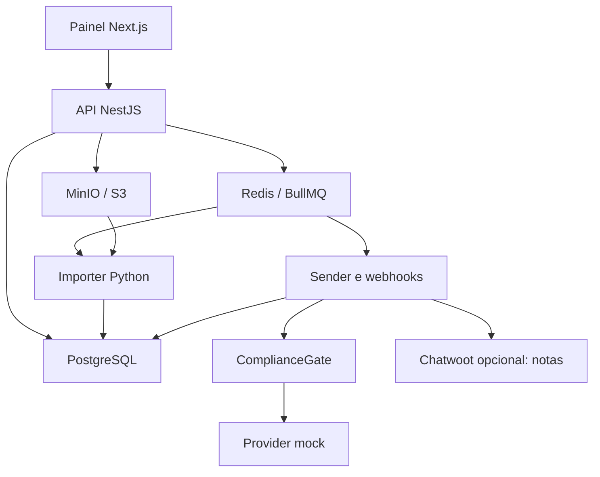

# NexaCred

Gestão de leads, importação XLSB, campanhas e atendimento com NestJS, Next.js, PostgreSQL, Prisma, Redis/BullMQ e Python. **Só o provider mock está habilitado:** não existe integração com WhatsApp nem envio real por SMS/e-mail.

## Executar em desenvolvimento

Requisitos: Docker Engine com Compose v2, 6 GB de RAM livres recomendados e espaço para a planilha descompactada. No Ubuntu, use o plugin `docker compose`.

```bash
git clone https://github.com/Nicolas-Assis-F/nexacred.git
cd nexacred
cp .env.example .env
docker compose up --build
```

- Painel: http://localhost:3000
- API / Swagger: http://localhost:3001/docs
- MinIO: http://localhost:9001
- Login inicial: `admin@nexacred.local` / `DevOnly-ChangeMe123!`

O serviço `secrets` gera chaves aleatórias no primeiro boot; elas ficam no volume `runtime_secrets`. Não apague esse volume: os dados antigos não poderão ser descriptografados sem a chave. Valores explícitos de chaves no ambiente têm precedência. O exemplo `.env` contém apenas credenciais públicas de desenvolvimento. Não publique essa instalação sem trocar credenciais, configurar TLS e desativar o seed.

O Compose espera PostgreSQL, MinIO e Redis, aplica migrations versionadas e executa seed idempotente. O seed cria somente dados fictícios, sem iniciar campanhas. A planilha do usuário não faz parte do repositório.

## Primeiro fluxo

1. Entre no painel e importe uma `.xlsb`. Informe o nome da aba ou deixe vazio para a primeira; adapte o JSON de mapeamento aos cabeçalhos. CPF e nome são obrigatórios. O progresso é atualizado por lote.
2. Abra **Leads**, selecione uma pessoa e registre consentimento, data real, origem e referência da prova. Importação **não cria consentimento**.
3. Crie um segmento e um template com o mesmo canal da campanha. `{{nome}}` é a variável permitida.
4. Crie a campanha, veja o preview, aprove e confirme explicitamente o início. Use janela 0–24 para testar a qualquer hora. Janelas normais usam `America/Sao_Paulo`.
5. O sender materializa destinatários, revalida elegibilidade, simula envio e gera entrega. Acesse **Conversas**, selecione o contato e simule `SIM` ou `SAIR`.
6. `SAIR`, `PARAR`, `CANCELAR`, `REMOVER` e `NÃO QUERO` registram supressão. Reimportar a pessoa não desfaz o bloqueio. Opt-outs não são removidos pelo painel.

Há uma fixture sintética de 1.306 colunas em `fixtures/leads-synthetic.xlsb` para validar mapeamento, duplicação e linha inválida. É uma fixture mínima do parser, não um catálogo comercial.

## Estrutura

```text
apps/api              REST, autenticação, RBAC, upload, auditoria
apps/web              painel Next.js e proxy de sessão HttpOnly
workers/importer      Python, XLSB incremental, lotes e checkpoints
workers/sender        preparação, envio mock, webhooks, reconciliação
packages/database     schema, migrations, seed e consultas de domínio
packages/shared       normalização, AES-GCM, HMAC, regras do bot
packages/compliance   gate independente, sem acesso a fornecedor
packages/messaging    port de providers e implementação mock
infrastructure        imagens Docker e inicialização
```



## Importação e dados pessoais

Upload em disco temporário e streaming para MinIO: o request não carrega o arquivo inteiro na memória. O processamento é assíncrono. O adaptador `StreamingWorkbook` usa o parser BIFF12 do pyxlsb, copia partes ZIP em blocos de 1 MB e mantém shared strings em SQLite temporário. Evita o `open_workbook()` original do pyxlsb 1.0.10, que lê partes inteiras em memória.

Batches de 500–2.000 linhas; dados, erros e progresso confirmados na mesma transação. Após interrupção, o job retoma pelo checkpoint. A releitura até o checkpoint custa I/O, mas não duplica os dados. Advisory lock protege importações concorrentes do mesmo ID. O total definitivo só é conhecido ao final. Cabeçalhos são lidos por nome; IDs de coluna não são fixos. O arquivo ZIP tem limite de tamanho descompactado configurável.

CPF validado, cifrado AES-256-GCM, HMAC-SHA256 para identidade e quatro dígitos para máscara. Contatos são cifrados e deduplicados por HMAC; não há coluna de telefone/e-mail normalizado em plaintext. A política atual de reimportação atualiza dados operacionais, preserva status, consentimentos e supressões e registra `LeadSource`. `IMPORT_UPDATE_POLICY=preserve` pode preservar os dados existentes; padrão `replace`.

Arquivos temporários locais são removidos ao terminar. Retenção de objetos usa lifecycle MinIO: padrão 7 dias; valor zero remove após importação. O ciclo do MinIO não é exclusão imediata no segundo exato. Arquivos criptografados, backups e chaves precisam ter retenção e acesso próprios em produção.

## Campanhas, filas e idempotência

Filas: `import-processing`, `campaign-preparation`, `message-send`, `webhook-processing`. O banco conserva o estado de mensagens, destinatários e eventos; o sender reconcilia trabalho pendente a cada 3 segundos. Os jobs usam IDs estáveis, tentativas e backoff exponencial. IDs de job não contêm dois-pontos.

O público é materializado em páginas de 500 e fica congelado após a preparação. Há UNIQUE por campanha/contato e campanha/hash de contato. O mesmo contato compartilhado por pessoas distintas recebe uma única mensagem por campanha. A primeira aprovação estabelece o limite temporal de inclusão de leads; não se incluem leads criados depois dela.

O gate é reavaliado imediatamente antes de **cada** chamada ao provider, inclusive resposta manual: pessoa ativa, contato válido, consentimento específico para canal/finalidade `CREDIT_MARKETING`, supressão global, status, datas, horário, frequência e quotas. Esta instalação exige consentimento. O consentimento mais recente aplicável decide autorização; uma revogação não é vencida por um registro antigo.

Um advisory lock no PostgreSQL serializa decisões de envio e processamento de opt-out entre réplicas. Limites usam janelas móveis de 1 e 24 horas; frequência padrão de 24h entre campanhas. Pausa, horários e quotas adiam jobs sem consumir tentativas. Cancelamento bloqueia jobs pendentes. O mock usa IDs determinísticos entre reinicializações. Eventos atrasados não rebaixam uma entrega confirmada; webhooks são únicos por provider/eventId e aplicados atomicamente.

**Limite deliberado:** serialização prioriza consistência em vez de alto throughput. Fornecedor real exige idempotência remota e reconciliação de resultado incerto antes de aumentar concorrência. A garantia do mock não equivale a exactly-once em uma rede externa.

## Conversas e Chatwoot

A inbox local permite histórico, atribuição, nota, status, resposta mock e bloqueio. O bot usa regras determinísticas; registra uma sugestão para o operador na nota. Não envia respostas automáticas nem aprova crédito, calcula score, define taxas ou promete aprovação.

Chatwoot é opcional e utiliza uma instalação existente:

1. Crie uma inbox do tipo **API** no Chatwoot.
2. Configure `CHATWOOT_ENABLED=true`, `CHATWOOT_URL`, `CHATWOOT_ACCOUNT_ID`, `CHATWOOT_INBOX_ID` e `CHATWOOT_API_TOKEN` no `.env`.
3. Recrie o sender: `docker compose up -d --force-recreate sender`.
4. Abra o Chatwoot por **Configurações**. Conversas novas serão associadas a contatos pseudônimos e mensagens serão espelhadas como **notas privadas**.

Não são enviados CPF cadastral, telefone, e-mail, margem ou score ao Chatwoot. Textos livres passam por remoção de sequências numéricas longas e e-mails antes da sincronização; isso não substitui revisão de privacidade. A sincronização é unidirecional: responda pelo NexaCred. Respostas digitadas no Chatwoot **não** disparam mensagens. Notas podem se repetir se o processo cair entre confirmação remota e checkpoint local. Não foi validado contra uma conta real sem credenciais; o adaptador segue as APIs oficiais de contatos, conversas e mensagens.

Referências: https://developers.chatwoot.com/api-reference/contacts/create-contact · https://developers.chatwoot.com/api-reference/conversations/create-new-conversation · https://developers.chatwoot.com/api-reference/messages/create-new-message

## Segurança e permissões

| Perfil | Ações adicionais |
|---|---|
| ADMIN | Todas as ações |
| MANAGER | Importar, segmentos, templates, campanhas, atendimento |
| OPERATOR | Atendimento |
| COMPLIANCE | PII autorizada, consentimentos, supressões, auditoria |
| VIEWER | Consultas sem PII completa |

JWT expira em 8h e verifica usuário ativo/perfil atual no banco. O browser usa cookie HttpOnly; o proxy verifica Origin em mutações. A API aceita Bearer e não autentica por cookie. Senhas usam Argon2; login tem limite de 5 tentativas/minuto/IP, a API tem throttling, Helmet e validação. Chaves não são devolvidas pela API. Webhooks mock exigem `x-webhook-secret`; simulação no painel exige perfil de atendimento. Payload bruto é armazenado cifrado. Auditoria não possui endpoints de edição/exclusão.

Antes de produção: trocar credenciais, TLS e `COOKIE_SECURE=true`, desativar seed, configurar proxy confiável/rate limiting distribuído, backup com teste de restauração, chaves em KMS através de `CryptoPort`, retenção de mensagens/PII, revisão de permissões e contratos de canais. Compose é ambiente de desenvolvimento de uma única organização, não multi-tenant.

## Desenvolvimento e testes

Node 24, pnpm 10.17.1, Python 3.13. Dependências Node estão travadas no lockfile.

```bash
corepack enable
pnpm install --frozen-lockfile
pnpm db:generate
pnpm -r --filter '!@nexacred/web' build
pnpm typecheck
pnpm lint
pnpm test
python -m venv .venv
.venv/bin/pip install -r workers/importer/requirements.txt
PYTHONPATH=workers/importer .venv/bin/pytest workers/importer/tests -q
pnpm build
```

E2E exige Compose em execução:

```bash
pnpm exec playwright install chromium
pnpm test:e2e
```

O E2E usa banco real, filas reais, MinIO, importador Python e provider mock: upload → deduplicação → consentimento → segmento → campanha → entrega → resposta → opt-out → reimportação sem reativação. O GitHub Actions executa lint, tipos, unitários, build Docker e Playwright. Resultados de execução estão em `docs/validation.md`; a existência de testes não significa que todos já foram executados com sucesso.

Migrations:

```bash
# Desenvolvimento, após editar schema:
pnpm --filter @nexacred/database migrate
# Aplicar migrations versionadas:
docker compose run --rm migrate
# Inspecionar serviços:
docker compose ps
docker compose logs -f api importer sender
```

## Novo MessagingProvider

Implemente `MessagingProvider` em `packages/messaging`: `send`, `parseWebhook` e validação de assinatura. Interfaces SMS/e-mail são contratos, não integrações habilitadas. Avalie autorização contratual do canal para o produto antes de conectar. Use ID idempotente persistido; distinga erros permanentes/transitórios; valide assinatura sobre bytes originais quando exigido; nunca contorne o gate. O registro do provider deve ocorrer no ponto de composição do worker. Não existe seleção arbitrária de fornecedor pelo frontend.

## Escopo atual

Não há exportação em massa, recuperação de senha, multiempresa, atribuição automática por equipe, edição de campanha aprovada ou envio real. A interface permite janelas por hora; `startAt`/`endAt` também existem na API. O Chatwoot não é instalado pelo Compose. O serviço não é um mecanismo de decisão de crédito. Antes de usar dados reais, valide o fluxo integrado, capacidade e restauração no seu ambiente.
